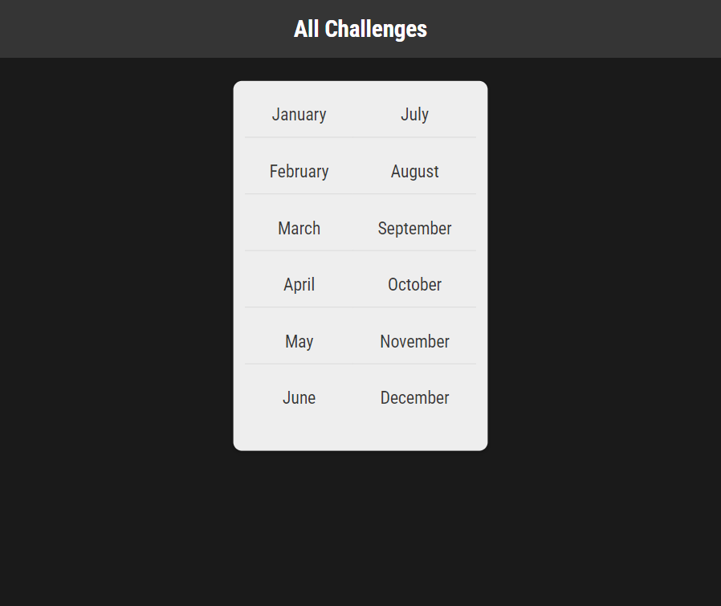
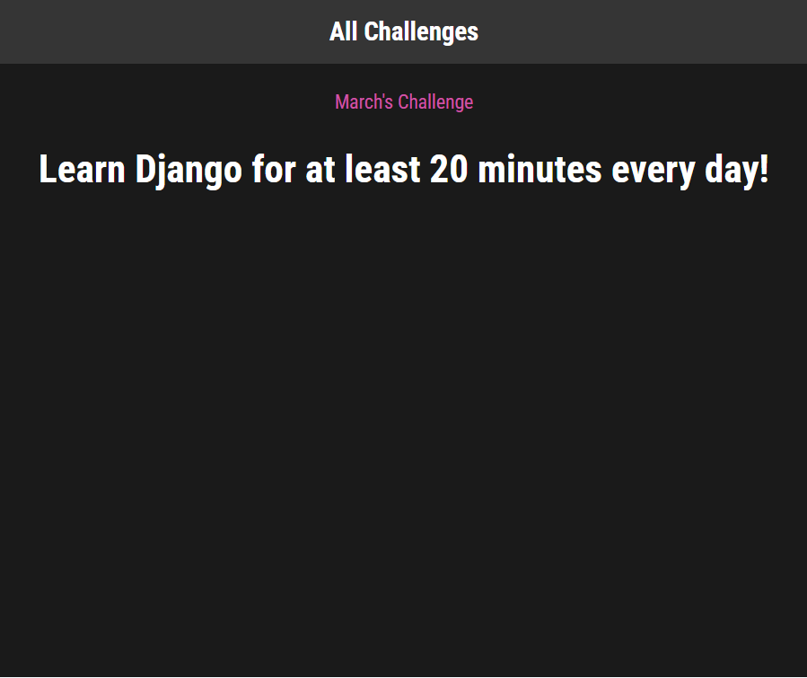

# Challenges - Django 

  ## Description

  A simple Django starter application demonstrating dynamic routing and the Django Templating Language (DTL).

  ### App Screenshots

  #### Home Page
  

  #### Monthly Challenge Page
  
  
  ## Table of Contents
  
  - [Installation](#installation)
  - [Usage](#usage)
  - [License](#license)
  - [Contributing](#contributing)
  - [Tests](#tests)
  - [Questions](#questions)
  
  ## Installation
  
  python manage.py runserver
  
  ## Usage
  
  Home page displays a list of months.  Simply click on a Month and be directed to the page for that Monthly Challenge!

  ## License
This application is covered under the MIT License.
 For more information: https://opensource.org/licenses/MIT
  
  ## Contributing
  N/A
  
  ## Tests
  N/A

  ## Questions
  Contact Info 
  GitHub user name: BillStephens2022 
  Link to GitHub profile: https://github.com/BillStephens2022 
  Email: stephensbill17@gmail.com
